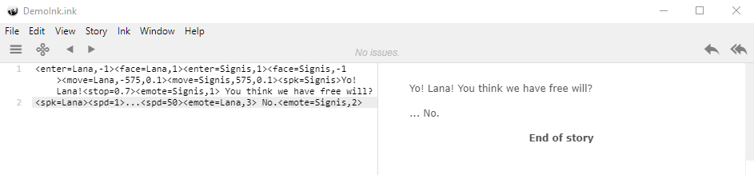
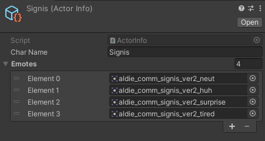

# Spax-Dialogue-Thing
Unity Dialogue system using , , and 

Currently built int Unity 2020.3.48f, but it shoulf generally work for (almost) any version of Unity (I think).

This uses tags to do everything, so it might be really unintuitive. But I can promise that this system can do much more thatn your garden variety dialogue system.
You should only have 1 DialogueManager per scene, call StartDialogue in DialogueManager to start dialogue.

The dialogue system uses tags to change character talking speeds, pauses, emotes, etc mid-dialogue, allowing for more animated conversations and characters.

Characters know what emotes to make by swapping the png from a list of pngs. Theorhetically, you can change the list of images with a list of animation parameters to trigger animations and not just swap sprites.

## Current Status: Beta

The system is functionally complete. Additional features may be added at a future date.

## Plans for the future
- Compatibility with 3d models as well.
- Being able to have side-bar dialogue.
- being able to change faces without changing the whole sprite
- Having the ability to bring up images to show illustrations or context.
- Make the project into a package for easier import.
- Use in a visual-novel style project.

## Getting Started

1) Clone the project
2) Import folders into desired project
3) Include necessary gameobjects in your scene (reference the example scene)
4) Make new Ink file and get started with writing

## Liscense

MIT
